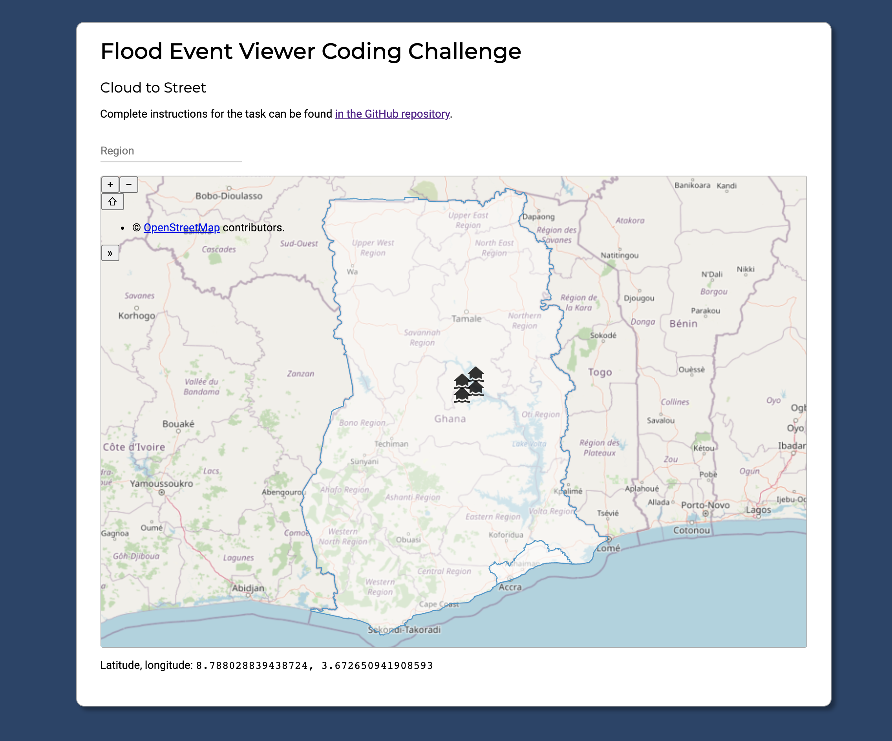
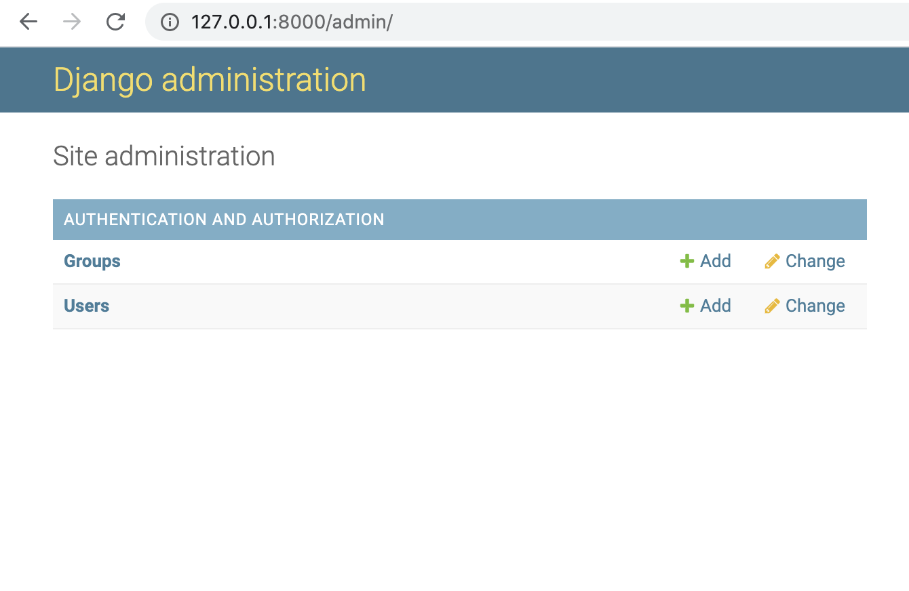

# Cloud to Street Flood Event Mapping Practical Exercise

## Up and running

You'll need the following software to develop the project. If on Windows, we recommend developing under [Windows Subsystem for Linux](https://docs.microsoft.com/en-us/windows/wsl/install-win10).

- [Git](https://git-scm.com/)
- [Node.js](https://nodejs.org/en/)
- [Python 3.x](https://www.python.org/downloads/)

Set up your project by running the following commands.

```sh
# Clone the git repository.
git clone git@github.com:jsninja777/fullstack-flood-event-display.git

# Enter the repository.
cd fullstack-flood-event-display

# Enter the Django folder.
cd flood_viewer_project

# If you haven't already, install the virtualenv Python module using Pip. Pip is included with Python since Python 3.4.
python -m pip install virtualenv

# Create a virtual environment.
python -m virtualenv venv

# Enter the virtual environment. Confused by Python's virtual environments? See https://docs.python.org/3/tutorial/venv.html
source venv/bin/activate

# Install the required Python packages.
python -m pip install -r requirements.txt

# Create or update the database. (manage.py is a script provided by Django for administrative commands.)
python manage.py migrate

# Add an administrator account. Username: admin, password: admin.
python manage.py shell -c "from django.contrib.auth.models import User; User.objects.create_superuser('admin', 'admin@example.com', 'admin')"

# Run the Django server. Leave the server running as you complete your exercise.
python -m manage runserver

# In another terminal, navigate to the angular-frontend/ subdirectory.
cd fullstack-flood-event-display/angular-frontend

# Install the Node package dependencies with npm install.
npm install

# You'll also need the Angular command line tools.
npm install -g @angular/cli

# Now run the frontend webserver. Leave the server running as you complete your exercise.
ng serve
```

When you navigate to [localhost:4200/](http://localhost:4200/), you should see the Angular frontend. It looks like this:



You can also find an interface to the Django backend at [localhost:8000/](http://localhost:8000/). The administrator username and password are both `admin`. Once logged in, it should look like this. Here's where you can create, view, update, and delete database entries.



At this point, the page doesn't do much. Four flooded house icons are displayed arbitrarily in the center of Ghana. One southern region of Ghana is highlighted arbitrarily. The region search box doesn't do anything. It's your task to build on top of what's given to turn this into a functional webpage that meets the requirements listed above.

## Project structure

To help you get started, let's go over the structure of the repo and some of the most important files.

```
.
|   * You're reading this file.
├── README.md
|
|   * The frontend Angular project.
├── angular-frontend
│   └── src
|       |
|       |   * The directory containing the all the UI components.
|       |   * This is where you'll write your frontend code.
│       ├── app
|       |   |
|       |   |   * The autocomplete search box component.
│       |   ├── autocomplete
|       |   |
|       |   |   * The map component.
│       |   ├── map
│       |   |   |
│       |   |   |   * The HTML template for the map.
│       |   |   ├── map.component.html
│       |   |   |
│       |   |   |   * The TypeScript code that controls the component.
│       |   |   ├── map.component.ts
│       |   |   |
│       |   |   |   * The stylesheet for the component.
│       |   |   └── map.component.css
│       |   |
│       |   |   * The main HTML template for the page. Contains the map and
│       |   |   * search box.
│       |   ├── app.component.html
│       |   |
│       |   |   * The TypeScript code that controls the component.
│       |   ├── app.component.ts
│       |   |
│       |   |   * A collection of functions for querying the backend.
│       |   └── django-api.service.ts
│       |
│       ├── index.html
│       ├── main.ts
│       └── styles.css
|
|   * The backend Django project.
└── flood_viewer_project
    |
    |   * The database.
    ├── db.sqlite3
    |
    |   * The project configuration folder. Here's where you add routes and
    |   * change settings.
    ├── flood_viewer
    |   |
    |   |   * Settings that apply to the whole Django project.
    │   ├── settings.py
    |   |
    |   |   * The file that associates URLs with views.
    │   └── urls.py
    |
    |   * The Django app folder. Here's where you'll define your models and
    |   * endpoints.
    ├── flood_viewer_app
    |   |
    |   |   * The admin site configuration. This is how you configure the
    |   |   * database admin interface at localhost:8000/admin.
    │   ├── admin.py
    |   |
    |   |   * The dataset describing the regions of Ghana.
    │   ├── ghana_geometry.py
    |   |
    |   |   * The database models.
    │   ├── models.py
    |   |
    |   |   * The endpoints that respond to HTTP requests for a given URL.
    │   └── views.py
    |
    |   * The script used for running administrative Django commands.
    └── manage.py
```
